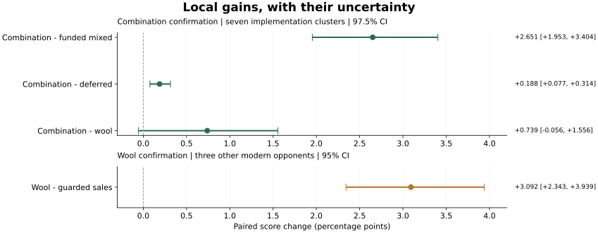

<div align="center">

# 🌾 Kaggriculture

**从农场调度、市场博弈到最终双方案：一份可追溯的比赛研究记录**

[](https://www.kaggle.com/competitions/kaggriculture)
[](notebooks/postmortem/evidence.json)
[](#比赛状态)

[最终方案](#最终提交方案) · [实验与教训](#实验告诉了我们什么) · [仓库地图](#仓库地图) · [复现入口](#复现与使用) · [文档索引](docs/INDEX.md)

</div>

---

## 项目是什么

Kaggriculture 是双人农场经营模拟赛。Agent 在一季 **720 个回合**中安排农民与工人，种植、养殖、补货、运输，并与对手在同一个市场交易。终局现金决定单局胜负；比赛再根据对局结果评定策略强度。

这个仓库保留了我们的策略开发、对手重建、配对评测、Slurm 作业、逐局诊断和最终提交。研究先后经过手工调度、公开轨迹重放、RL 探索，最后落在**公开响应式策略基础上的市场排序、仓容管理和交仓时机改进**。

### 比赛状态

> **文档整理于 2026-10-01；最终排名和奖牌仍待主办方公布。**
> 最终提交截止：**2026-09-30 23:59 UTC**。截止后官方回读确认两个活跃方案均为 `COMPLETE`。本仓库记录已完成的参赛工作，不宣称已经保银或获金。

官方规则是在截止后继续进行约两周对局，再拟合 Bradley–Terry 评分；队伍取两个最终 Agent **整体评分中较高的一个**。具体见 [时间线](https://www.kaggle.com/competitions/kaggriculture/overview/timeline)、[评分规则](https://www.kaggle.com/competitions/kaggriculture/overview/evaluation)及[官方双提交说明](https://www.kaggle.com/competitions/kaggriculture/discussion/739410)。

## 赛后 Notebook

**[在 Kaggle 阅读与运行 →](https://www.kaggle.com/code/jwj1342/kaggriculture-final-strategy-and-lessons)** · [本地 Notebook](notebooks/postmortem/kaggriculture-final-strategy-and-lessons.ipynb)

Notebook 包含中文复盘、英文摘要、确认实验图表，以及两份**与实际上传字节一致**的最终源码。运行全部单元格会生成可下载源码、许可证、原审查记录和校验清单；原始提交包另附 Release 下载链接。无需 API 密钥、GPU 或联网，也不会发起比赛提交。

| 阅读方式 | 内容 |
| :--- | :--- |
| 本页 | 项目全貌、最终方案和最短复现路径 |
| [Notebook](notebooks/postmortem/kaggriculture-final-strategy-and-lessons.ipynb) | 为什么这样设计、哪些证据支持它、哪些结论不能成立 |
| [冻结结果摘要](notebooks/postmortem/evidence.json) | 提交身份、确认规模、区间和来源 SHA-256 |
| [执行记录](docs/ENDGAME_EXECUTION.md) / [提交台账](docs/RUNS.md) | 截止前每次选择、审查与实际上传经过 |

## 最终提交方案

| | **Mixed deferred** · 主要方案 | **Wool priority** · 第二方案 |
| :--- | :--- | :--- |
| Kaggle 提交号 | **56720412** | **56721680** |
| 上传时间，UTC | 09-30 22:39:43 | 09-30 23:36:43 |
| 官方入口 | `deferred_capacity_agent` | `wool_delivery_priority_agent` |
| 思路 | 调整完全融资的混合买卖顺序，并延后部分夜间补货 | 让携带羊毛的目标工人优先完成交仓 |
| 冻结源码 | [main.py](submissions/2026-09-30-mixed-deferred/main.py) | [main.py](submissions/2026-09-30-wool-priority/main.py) |
| 原始提交包 | [submission.tar.gz](submissions/2026-09-30-mixed-deferred/submission.tar.gz) | [submission.tar.gz](submissions/2026-09-30-wool-priority/submission.tar.gz) |
| 独立审查 | [REVIEW.md](submissions/2026-09-30-mixed-deferred/REVIEW.md) | [REVIEW.md](submissions/2026-09-30-wool-priority/REVIEW.md) |

### 主要方案如何工作

```text
继承的响应式路线与生产策略
          │
          ▼
纯 SELL 排序保护层
          │
          ├── 完全融资的混合订单排序 ── 延期补货 / 观察确认后恢复 ── Mixed deferred
          │
          └── 携带羊毛时跳过部分可选采肥，让交仓优先 ─────────── Wool priority
```

- **销售排序**：同一回合的订单顺序会影响共享市场中的成交收益。纯卖单层在保守条件下重排订单，保持数量与物理动作。
- **混合订单排序**：对 2–6 条完全融资、完全成交的买卖订单做有界排列；最多检查 720 种顺序。该层保持订单数量与预测终仓。
- **延期补货**：外层可能减少符合条件的夜间采购，腾出仓容，并用后续观察确认的恢复额度补回。它会改变最终数量，不能把内层的数量保持性质套到整个组合上。
- **羊毛优先**：另一分支让三个目标工人在携带羊毛时少做可选采肥，优先交仓。它不包含混合排序和延期补货层。

这些层会影响后续市场价格、生产和继承策略的选择；收益与代价都经过单独检查。

### 为什么保留这两份

组合方案在新种子确认中优于它的 mixed 父版本。最后一个槽位改用 wool，是因为它保留了一种不同响应方式，而最终规则取两份整体评分的较高者。

这次槽位选择使用了**事后描述性比较**：确认面板中 mixed 没有比组合得分更好的配对格；wool 有 284 格，来自 61 个世界，但它在七组现代对手上的平均表现仍低于组合。我们不能逐局选择赢家，这 284 格也不能当成最终比赛的额外胜场。选择依据和反方意见保存在 [提交台账](docs/RUNS.md)。

## 实验告诉了我们什么

**得分率 = (胜场 + 0.5 × 平局) / 总局数。** 以下是同场地、同种子、同座位的配对变化，单位为百分点（pp）。

| 比较 | 对手范围 | 得分率变化 | 区间 |
| :--- | :--- | ---: | :--- |
| 组合 − mixed | 七组现代实现簇 | **+2.65067 pp** | 97.5% CI `[+1.95304, +3.40411]` |
| 组合 − deferred | 同上 | +0.18834 pp | 97.5% CI `[+0.07673, +0.31390]` |
| 组合 − wool | 同上 | +0.73940 pp | 97.5% CI `[−0.05589, +1.55561]` |
| wool − guarded | cha22 / funding / shepherd | +3.092 pp | 95% CI `[+2.343, +3.939]` |



组合确认共 **419,840 局**，羊毛确认共 **77,824 局**。每个实验各有 **1,024 个独立世界种子**；双座位及 `PYTHONHASHSEED=0/4` 复用这些世界，两个 hash 块分别验收，不能把它们当作独立样本叠加。七组结果先在簇内平均，再按簇等权平均；对手实现簇也存在共同祖先。

区间支持组合相对 mixed 的本地改进；**尚未证明组合优于 wool，也无法由这些数字推算奖牌概率**。两组实验的对手范围和置信水平不同，不能直接按表中增益大小排候选强弱。

### 稳健性与实际代价

| 检查 | 组合方案 | 羊毛方案 |
| :--- | :--- | :--- |
| 实际提交包压力测试 | 28 / 28 | 28 / 28 |
| 单 CPU 慢局复验 | 1,222 局；候选最慢 0.416425 秒 | 214 局；候选最慢 0.300854 秒 |
| 资源诊断范围 | 20,224 个不同探索局；另查 252 个正式尾部局 | 9,216 个资源观察局；另查 20 个确认回归格 |
| 保留的反例 | 部分减产、溢出与现金回退 | 少采肥引发部分供肥失败、减产和现金回退 |

原并行运行的慢回合峰值仍保留；隔离复验不构成 Kaggle 硬件延迟保证。新层诊断通过，也不意味着继承代码没有回退行为。两份提交的验证局、首两场公开局及首败均完成记录复验；这只覆盖已检查样本。

### 尝试过的路线

| 路线 | 做过什么 | 后来怎样选择 |
| :--- | :--- | :--- |
| 手工引擎与调度 | 原子策略组合、11 种工人调度、作物与动物经济 | 修复了规则缺陷；自建场收益不足以代表真实竞争 |
| 轨迹与混合接管 | 强队回放、开局重放、市场包装、接回自有引擎 | 修复错一帧重放；保留计划骨架，增加观测响应 |
| 市场博弈 | 倾销、囤积、抢跑、切片、按商店选择计划 | 多条干扰路线无效；后续窄排序改动重新独立确认 |
| 完整 RL | PPO、BC、课程、自博弈、张量引擎、逐工人动作头 | 工程与吞吐提升，已试流程仍未达到强对手目标；09-29 归档 |
| 奖励与市场残差 | 长期信用、资产估值、多订单残差、实际 RL/混合体提交 | 发现奖励投机、采购路径缺失、导出与训练身份不一致等问题 |
| 截止前机制改进 | 牧场修复、储肥、购牛、仓容、排序、羊毛交仓 | 停止未达门槛的候选；最终采用组合与羊毛两份 |

完整的**假设 → 实验 → 结果 / 停止原因 → 坑与修正**见 [研究路线与踩坑复盘](docs/RESEARCH_LESSONS.md)，含 12 个主题和具体历史提交引用；相同内容也收录于 Notebook。

### 最值得保留的教训

1. **评测结论需要接受后续更正。** 早期尺子曾被判成功、反转，随后因线上读数未稳定又撤回“已知答案”资格。固定轨迹适合回归，响应式对手才能检验市场反馈。
2. **赚钱更多不一定更强。** 钱用于判断单局胜负；跨不同棋盘比较平均现金，容易把世界难度当成策略收益。
3. **种子相同也不保证世界完全相同。** 策略动作改变随机数消耗，进而改变杂草和商店。配对仍有用，但不是完全固定的外部环境。
4. **单层有效不等于组合有效。** 最终组合重新做独立确认，并检查真实包、缓存、资源恢复、生产尾部和运行时间。
5. **最晚的决定也要留下反方证据。** 独立 subagent 复核原始结果并追查反例；最终槽位选择的事后性质没有被包装成预先验证的结论。

## 仓库地图

```text
Kaggriculture/
├── README.md                 项目总览与最终交付入口
├── notebooks/postmortem/     赛后 Notebook、冻结摘要、Kaggle 发布配置
├── submissions/              按日期冻结的源码、原始包、许可证与审查
├── agents/                   手工引擎、规则表、早期模块化策略和历史探针
├── benchmarks/               固定历史回归对手
├── tools/                    生成、测量、诊断、打包、数据与发布工具
├── slurm/                    集群作业入口；长任务在计算节点运行
├── docs/                     协议、机制分析、执行记录及历史快照
├── reference/                引擎、官方说明与公开参考 Notebook
├── requirements/             基础依赖、引擎安装策略和旧环境快照
├── tests/                    统计工具测试
├── dist/                     可重建产物；保留轨迹库等已跟踪快照
└── data/                     本地数据库、评测分片、回放和归档（通常忽略）
```

生成的 `agents/lib/`、`agents/wrapped/`、`agents/newlines/` 等目录通常不在 Git 中。最终可交付策略以 `submissions/2026-09-30-*/` 的冻结文件为准。RL 线于 09-29 归档，可从归档包及历史提交恢复。

<details>
<summary><strong>工具导航：按要完成的事情查找</strong></summary>

| 任务 | 入口 |
| :--- | :--- |
| 安装环境 / 生成 Notebook | `bootstrap.sh`、`build_notebook.py`、`build_postmortem.py` |
| 策略与对手生成 | `registry.py`、`wrap.py`、`hybrid.py`、`ghost.py`、`lines.py`、`make_probes.py`、`fetch_fields.sh` |
| 对战评测与统计 | `eval.py`、`tournament.py`、`stats.py`、`ruler_calib.py`、`opening_value.py` |
| 看一局发生了什么 | `trace.py`、`board.py`、`tracelib.py`、`stress.py` |
| 截止前专项工作流 | `endgame_eval.py`、`endgame_diagnostics.py`、`endgame_preflight.py`、`endgame_ingest.py`、`endgame_watch.py` |
| 数据库与同步 | `db.py`、`datalake.py`、`sync.py`、`d1.py` |
| 线上记录与报告 | `ladder.py`、`topeps.py`、`leaderboard.py`、`fieldtable.py` |
| 历史打包与发布 | `package.sh`、`kaggle_cli.py`、`publish.sh` |

所有入口位于 [tools/](tools/)。部分历史脚本需要本地数据或项目专属配置；使用前查看 `--help` 和 [协作说明](docs/CONTRIBUTING.md)。

</details>

## 复现与使用

### 1 · 先阅读，再决定复现范围

Notebook 的 **Run All** 只需要常规 Python、pandas、matplotlib 和 IPython：它校验并导出最终源码、展示冻结统计摘要和图表。**它不会重新计算原始逐世界 bootstrap，也不重跑几十万局锦标赛。** 完整实验还需要对应对手源码、manifest、原始分片及指定引擎。

### 2 · 建立游戏运行环境

```bash
git clone https://github.com/jwj1342/Kaggriculture.git
cd Kaggriculture

# 仅新环境执行：此脚本会重建现有 venv
bash tools/bootstrap.sh
source setup_env.sh

# 冻结赛后复现使用的引擎；普通安装脚本默认跟随更新
python -m pip install --no-deps kaggle-environments==1.32.7
```

最终确认使用 Python 3.11。`requirements/lock.txt` 是历史集群环境快照，含平台专属依赖；不要把它当成跨平台的一键安装清单。联网下载与 Kaggle 操作放在登录节点；评测、训练和大规模诊断放到 Slurm。

### 3 · 校验最终文件

```bash
(cd submissions/2026-09-30-mixed-deferred && sha256sum -c SHA256SUMS)
(cd submissions/2026-09-30-wool-priority && sha256sum -c SHA256SUMS)
```

### 4 · 做一次本地比较

```bash
# 集群：先检查 slurm/eval.sh 内的账户、项目路径和资源设置
sbatch slurm/eval.sh h2h \
  submissions/2026-09-30-mixed-deferred/main.py \
  submissions/2026-09-30-wool-priority/main.py --seeds 32

# 普通工作站：相同入口可直接运行，小样本仅用于复现流程
python tools/eval.py h2h \
  submissions/2026-09-30-mixed-deferred/main.py \
  submissions/2026-09-30-wool-priority/main.py --seeds 4 -j 2
```

两份最终版本的直接对打不能替代原多对手确认实验。旧 `eval.py` 输出中的 `win rate` 实际含平局半分，其区间按对局计算，没有保留世界簇；上述命令只用于跑通比较流程，不复现本页正式区间或验收门。统计协议及历史变化见 [VALIDATING.md](docs/VALIDATING.md)；最终审查记录中的协议优先用于解释本页数字。

## 数据归档

Git 保存代码、结论、提交身份和 Notebook；大型 SQLite、原始回放及实验分片单独归档。归档入口为 [赛后 Release](https://github.com/jwj1342/Kaggriculture/releases/tag/postmortem-2026-10-01)，包含本地约 497 万局数据库、独立 D1 SQL/SQLite、RL 历史包和最终提交。所有归档已回下载校验，D1 两种格式均恢复成功；对应 Cloudflare D1 已删除，本地原件保留。范围、证据与恢复命令见 [ARCHIVE.md](docs/ARCHIVE.md)。

## 文档路线

| 想了解什么 | 从这里开始 |
| :--- | :--- |
| 最终为什么这样提交 | [ENDGAME_EXECUTION.md](docs/ENDGAME_EXECUTION.md)、[RUNS.md](docs/RUNS.md) |
| 尝试过哪些路、为什么转向 | [RESEARCH_LESSONS.md](docs/RESEARCH_LESSONS.md) |
| 哪些文件是当前结论、哪些是历史记录 | [INDEX.md](docs/INDEX.md) |
| 测量与复现方法 | [VALIDATING.md](docs/VALIDATING.md)、[CONTRIBUTING.md](docs/CONTRIBUTING.md) |
| 早期机制分析与失败经验 | [ANALYSIS.md](docs/ANALYSIS.md)、[LADDER_STATE.md](docs/LADDER_STATE.md) |
| 公开来源与赛前判断 | [ENDGAME_PUBLIC.md](docs/ENDGAME_PUBLIC.md)、[DISCUSSIONS.md](docs/DISCUSSIONS.md)、[ENDGAME.md](docs/ENDGAME.md) |
| 历史安装与提交流程 | [ONBOARDING.md](docs/ONBOARDING.md)、[SUBMISSION_POLICY.md](docs/SUBMISSION_POLICY.md) |

历史文档保留当时的判断和约束，部分命令引用已归档路径；其中的天梯分、活跃提交和“当前面板”均有时间背景。

## 致谢与来源

最终策略建立在 Kaggriculture 社区公开控制器之上，包含 **Thomas Tschinkel、Yusuke Hayashi、aurax7、Ahmed Berat Ozer、shiiin9、Dmitrii Gluzdov** 等作者的贡献与继承代码。我们的截止前工作主要是局部控制层、组合验证、资源与运行审计，以及最终槽位选择。

两份最终包均保留 Apache-2.0 许可证、源码内注释和完整 NOTICE：[组合来源声明](submissions/2026-09-30-mixed-deferred/NOTICE.txt) · [羊毛来源声明](submissions/2026-09-30-wool-priority/NOTICE.txt)。历史文件的许可应按各自来源判断；上游路线数据仍有 NOTICE 已说明的溯源限制。游戏引擎来自 [Kaggle/kaggle-environments](https://github.com/Kaggle/kaggle-environments)。

---

<div align="center">
<sub>保留可核查的收益，也保留失败、成本与尚未确定的结果。</sub>
</div>
